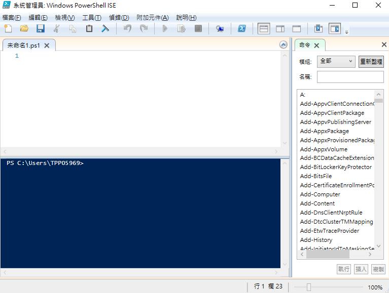

# 基礎指令

### `$psversiontable` 查詢PS版本

### `update-help -force` 更新 Help 資訊\(需Administrator\)

### `get-verb` 查詢可用動詞

參數 `-verb S*`  查詢S開頭的動詞

### `get-service` 查詢所有服務

簡寫 `gsv`。參數 `-name m*` 查詢m開頭的Service

### `get-help` 取得幫助

簡寫`git-help get-service` 取得 `get-service` 使用方式。`help get-service -online` 開啟網頁說明頁。  
`help get-service -ShowWindow` 開啟視窗說明。

### `get-command` 讀取指令用法

簡寫 `gcm` 

`get-command  -verb *New` 輸出 New 開頭的指令。

輸入`get-command -name *IP*` 找尋所有關於IP的設定。

`NetTCPIP` 就是模組名稱。

輸入`get-command -name *IP* -module nettcpip | more`找尋所有關於IP的設定與模組為 `nettcpip` 的命令。

### get-history 查詢歷史指令

輸入 `get-history` 輸出所有執行過的命令

輸入`invoke-history -id 64` 執行id為64的歷史指令。  
輸入 `get-history | out-file c:\historyscript.txt` 將歷史紀錄寫入 txt檔

### start-transcript log紀錄

輸入 `start-transcript -path c:\Transcript.txt`

輸入 `stop-transcript` 停止紀錄。開啟記錄檔，可以查看詳細 log 資料。

### get-member 讀取指令下的參數與方法

輸入 `get-service | get-member` 查詢 get-service 下的方法與參數

輸入`get-service | select-object name,status` 可以查詢欄位name與status

輸入 `get-service | where-object status -eq "stopped"` 查詢物件Status 為 stopped

### Format

format-list\(fl\)、format-table\(ft\)

輸入`get-service | format-list | more` 列出Service 詳細資料

### Ise

輸入 `ise` 可以開啟Windows PowerShell ISE 編輯介面

### show-command 指令產生器

輸入 `Show-Command get-eventlog` 跳出 get-eventlog 產生器

